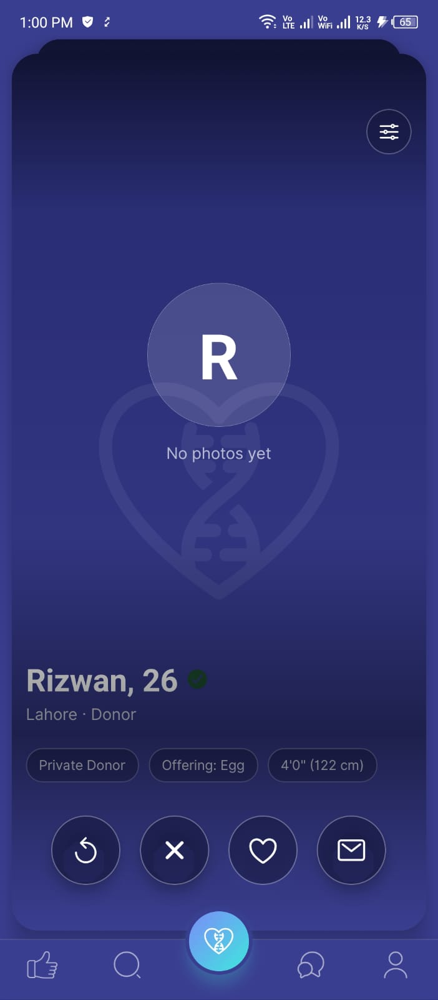
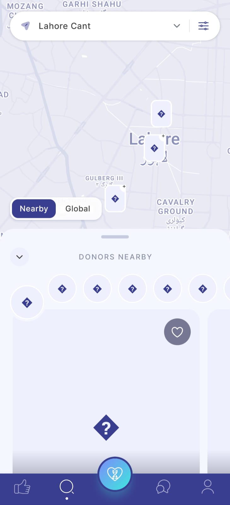
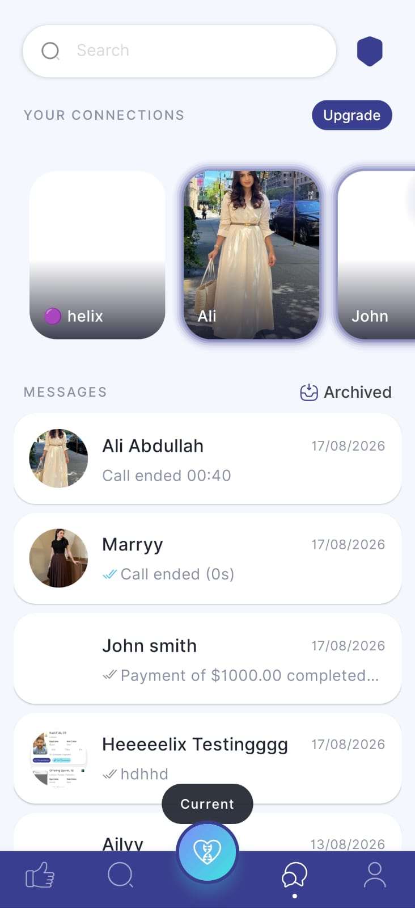
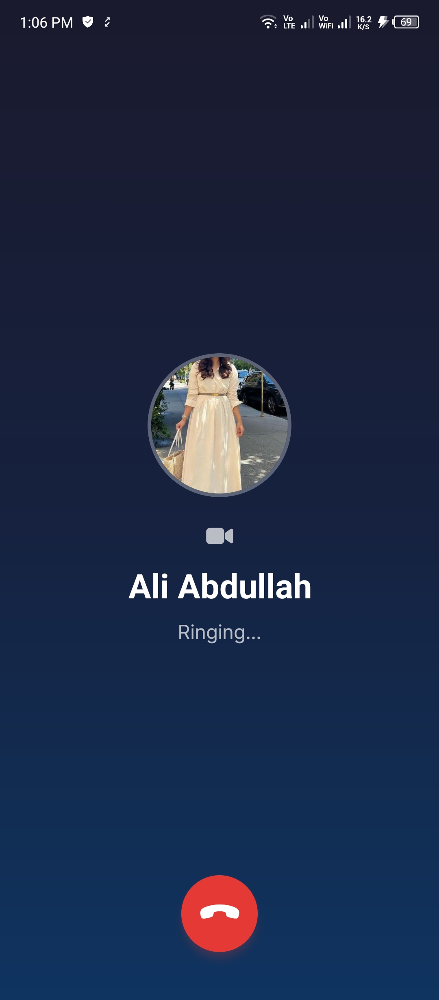
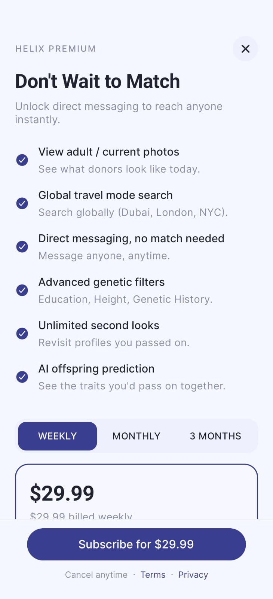

# Helix Match — Donor & Surrogacy Matchmaking App

> **Note:** This repository is a case study, not a source dump. It was built at work for a production client product; the source is proprietary. This README documents the architecture, my role, and the engineering decisions behind it.

 

## Overview

Helix Match is a React Native mobile app for fertility-focused matchmaking — connecting people seeking sperm/egg donors or surrogacy with donors and related profiles. Users complete a multi-stage onboarding flow covering identity, photos, health, genetics, compensation, and legal steps, then discover matches through swipe-based matching and map/filter search.

Once matched, users chat in real time, send offers/bids, and unlock premium features through subscriptions. The app also supports voice intros, genetic screening flows, and push notifications that deep-link into chats, profiles, and calls — a full end-to-end product for donor discovery, communication, and monetized premium access, not a simple dating clone.

## My Role

Built and owned the frontend mobile app solo — screens, navigation, API/socket integration, chat/calls, onboarding, and release/OTA support — working against a backend API built by a separate team.

## Tech Stack

| Layer | Technologies |
|---|---|
| Mobile | React Native 0.72, React 18 |
| Navigation | React Navigation (stack, tabs, drawer) |
| State | Redux Toolkit + redux-persist |
| Networking | Axios (REST) + Socket.IO (realtime) |
| Calls | WebRTC + CallKeep / VoIP push (audio-video) |
| Auth & Push | Firebase (push/auth helpers), Notifee, Google/Apple social login |
| Location | Google Maps, Geolocation, Google Places |
| Forms & i18n | Formik/Yup, i18next |
| Release | CodePush (Revopush OTA) |

## Architecture

```
┌───────────────────────┐   REST (Axios)    ┌──────────────────────┐
│                        │ ─────────────────▶│                       │
│   React Native App     │                    │    Backend API        │
│  (onboarding, match,   │◀─────────────────  │  (matching, billing)  │
│   discovery, profile)  │                    │                       │
└──────────┬─────────────┘                    └───────────┬───────────┘
           │  Socket.IO (polling → WS upgrade)             │
           ▼                                               ▼
     Real-time Chat                                  Push Notification
                                                       Service (FCM)
┌────────────────────────┐
│  WebRTC + CallKeep      │
│  Audio/Video Calling    │◀── VoIP push wake-up
└────────────────────────┘
```

## Standout Features

- **Multi-Stage Onboarding** — sequential profile stages covering identity, health, genetics, compensation, and verification, each independently resumable.
- **Swipe-Based Discovery** — swipe matching plus a "Likes Me" reverse-discovery view.
- **Map & Filter Search** — location-, ethnicity-, and genetics-based filtering on a map interface.
- **Real-Time Chat** — Socket.IO with a polling-to-WebSocket upgrade handshake for reliable connection across network conditions.
- **Audio/Video Calling** — WebRTC integrated with CallKeep and VoIP push, so incoming calls wake the app from background/killed states like a native phone call.
- **Monetization** — premium subscriptions, DM credit packs, and an offer/bidding marketplace layered on top of matching.
- **OTA Releases** — CodePush/Revopush for shipping fixes without app-store review delays.

## Screenshots

<!-- Add images to a screenshots/ folder and reference them below -->

| Swipe Discovery | Map & Filter Search | Filters |
|---|---|---|
|  |  |  |

| Real-Time Chat | Video Call | Premium/Offers |
|---|---|---|
|  |  |  |

## What I'd Improve Next

- Move the polling→WebSocket handshake to a pure WebSocket connection with a lighter reconnect/backoff strategy
- Add end-to-end encryption for chat given the sensitivity of the data involved
